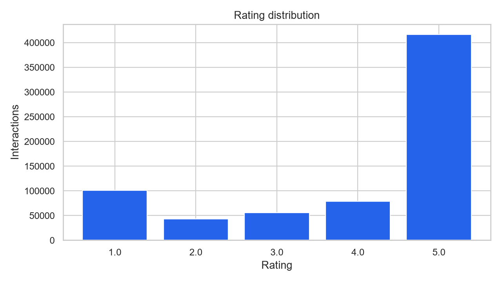
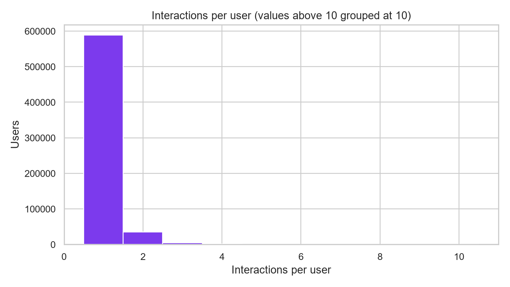

# Day 1 exploratory data analysis

## Dataset profile

| Measure | Value |
| --- | ---: |
| Interactions | 694,252 |
| Users | 631,986 |
| Items | 112,565 |
| Mean rating | 3.961 |
| Positive interactions (rating ≥ 4) | 71.31% |
| Average interactions per user | 1.099 |
| Average interactions per item | 6.168 |
| User-item matrix density | 0.00097590% |
| Matrix sparsity | 99.999024% |
| Interaction period | 2000-11-01 to 2023-09-09 |

## Rating distribution

| Rating | Interactions |
| ---: | ---: |
| 1 | 100,888 |
| 2 | 42,601 |
| 3 | 55,720 |
| 4 | 78,608 |
| 5 | 416,435 |

## User activity

The interaction matrix is extremely sparse: the average user has only about one interaction.
This is a realistic cold-start and sparsity challenge. Popularity and content-based
approaches will therefore be important baselines, while collaborative models will be
evaluated only on users with sufficient history.

## Most-interacted products

| Item ID | Product title | Interactions |
| --- | --- | ---: |
| B085BB7B1M | Salux Nylon Japanese Beauty Skin Bath Wash Cloth/towel (3) Blue Yellow and Pink | 1,952 |
| B0BM4GX6TT | Godefroy Tint Kit for Spot Coloring, Dark Brown | 1,726 |
| B07C533XCW | Segbeauty empty bottle 160083 | 1,500 |
| B09X9BG4FC | Makone Crystal Crowns and Tiaras with Comb Headband for Girl or Women Birthday Party Wedding Prom Bridal Christmas Valentine… (03 Pink) | 1,365 |
| B00R1TAN7I | GranNaturals Boar Bristle Smoothing Hair Brush for Women and Men - Medium/Soft Bristles - Natural Wooden Large Flat Square Paddle Hairbrush for Fine, Thin, Straight, Long, or Short Hair | 1,362 |

## Decisions carried into Day 2

1. Preserve chronological event times and use time-aware splits to prevent future leakage.
2. Keep explicit ratings, then define positive implicit feedback as `rating >= 4`
   for top-K evaluation experiments.
3. Use `item_text` (title, description, features, store) for content features
   because the raw category field is empty.
4. Report popularity and cold-start performance separately from personalized-model performance.
